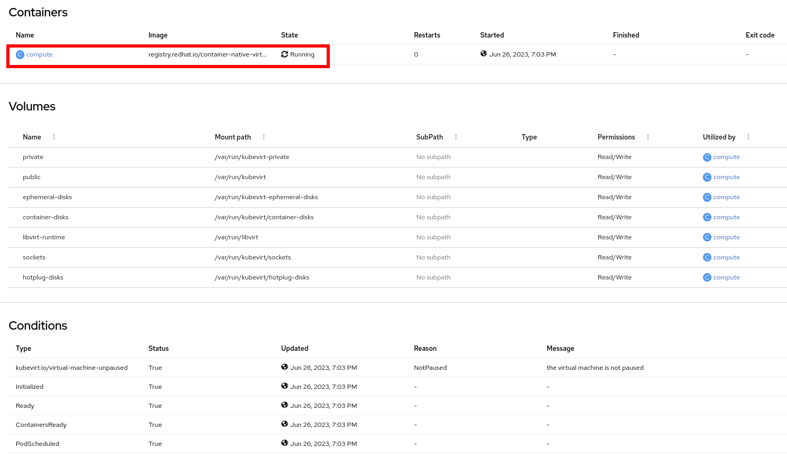
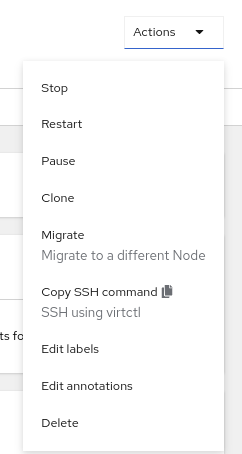
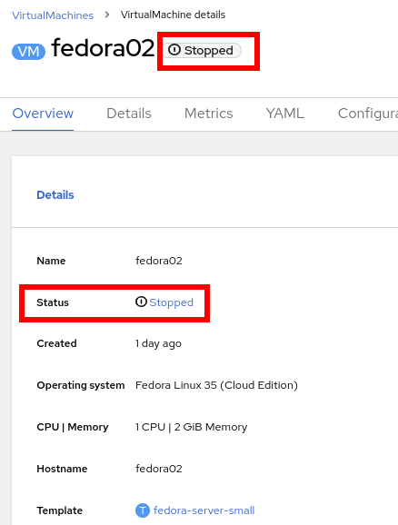
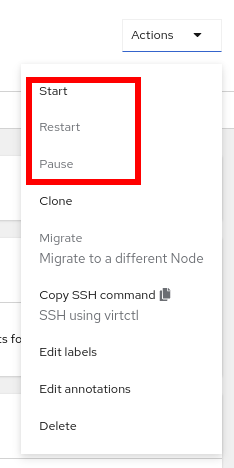
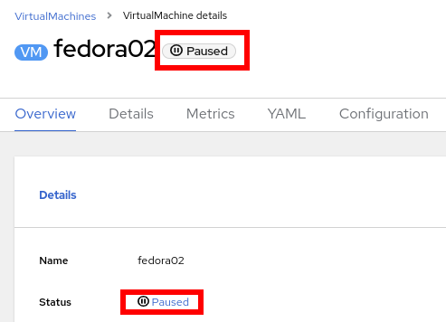

:scrollbar:
:toc2:

= Pod and Virtual Machine Management Lab

:numbered:

== Introduction to Pod and Virtual Machine Management

In this lab, you explore the Pod associated with the virtual machine (VM) and you run commands inside the container to explore the associated storage and network.
You will learn how to manage the Virtual Machine, using the GUI and the CLI.

.Goals
* Examine the Pods associated with a VM
* Gain experience with VM management using GUI and CLI

=== Explore Pods Related to Virtual Machine

. In the Red Hat^(R)^ OpenShift^(R)^ Container Platform web console, navigate to *Workloads* -> *Pods* and expect to see a list of the Pods associated with this VM:
+
image::images/Pods_Migration/10_Pod_List.png[]

. Select the Pod prefixed with `virt-launcher-fedora02-`.

. Review the information shown on the *Details* tab--especially the information included for *Owner* and *Pod IP*:
+
image::images/Pods_Migration/11_Pod_Details.png[]
+
The IP address corresponds to the accessible VM's IP address.
+
Notice the the owner of the *POd* i a `VirtualMachineInstance (VMI)` resource. A `VirtualMachineInstance` resource indicates a running _Virtual Machine_.

. Scroll down further to see information about the containers in the Pod:
+

+
The VM is running inside the `compute` container.

. Navigate to *Metrics* tab to see what metrics are available:
+
image::images/Pods_Migration/11_Pod_Metrics.png[]
+
This metrics are related to the *Pod*. They are a good overview about the resource used by the _Virtual Machine_.

. Navigate to the *YAML* tab and review the Pod definition:
+
image::images/Pods_Migration/12_Pod_YAML.png[]
+
As described before, resources on Kubernetes are defined in _YAML_ format.

. Navigate to the *Terminal* tab and see that you can connect to the container:
+
image::images/Pods_Migration/14_Pod_Terminal.png[]

. Using the `virsh` command, list the VMs:
+
[source,sh]
----
sh-4.4# virsh list
----
+
.Sample Output
[source,texinfo]
----
 Id   Name                  State
-------------------------------------
 1    vmexamples_fedora02   running
----
+
[IMPORTANT]
A _Pod_ is running only one _Virtual Machine_.

. List the disks associated with the VM:
+
[source,sh]
----
sh-4.4# virsh domblklist 1
----
+
.Sample Output
[source,texinfo]
----
 Target   Source
---------------------------------------------------------------------------------------------
 Target   Source
---------------------------------------------------------------------------------------------
 vda      /dev/rootdisk
 vdb      /var/run/kubevirt-ephemeral-disks/cloud-init-data/vmexamples/fedora02/noCloud.iso
----

. List the network interface associated with the VM:
+
[source,sh]
----
sh-4.4# virsh domiflist 1
----
+
.Sample Output
[source,texinfo]
----
 Interface   Type       Source   Model                     MAC
------------------------------------------------------------------------------
 tap0        ethernet   -        virtio-non-transitional   02:62:c3:00:00:03
----

=== Virtual Machine Management with the GUI

==== Controlling virtual machine state

You can stop, start, restart, and unpause virtual machines from the web console.

. In the left menu go back to *Virtualization* -> *VirtualMachines*:

. Select the _Virtual Machine_ `fedora02` from the list.

. Press the top-right dropdown *Actions* to list the available 
options:
+

+
.. *Stop*: Starts a graceful shutdown of the _Virtual Machine_.
.. *Restart*: It sends a signal to the operating system to reboot the _Virtual Machine_.
.. *Pause*: The process is frozen without further access to CPU resources and I/O but the memory used by the domain at the hypervisor level will stay allocated.
. Press *Stop* and wait till the _Virtual Machine_ is in state `Stopped`.
+

. Clicking on *Actions* the option *Start* appears and the options *Restart* and *Pause* are greyed out. 
+

. Press *Start*, and wait for the `Running` status.

. Using the *Actions* menu, press the *Pause* option. The _Virtual Machine_ state will change to `Paused`.
+

. Unpause the _Virtual Machine_ using *Actions* and the option *Unpause*.

==== Live Migrate Virtual Machine

In this section, you migrate the VM from one worker node to another without shutting down.

. Navigate to the *Details* tab to see where the worker node is running:
+
image::images/Pods_Migration/17_VM_Info_Node.png[]

. Using the menu *Actions* press *Migrate*
+
image::images/Pods_Migration/19_VM_Dialog_Migrate.png[]

. The VM will change the status to `Migrating`. After some seconds ensure it was moved correctly
+
image::images/Pods_Migration/21_Migrated.png[]

=== Resize a Virtual Machine

It is possible to change the resources, CPU and Memory, associated to a _Virtual Machine_ after it is created. 

. In the *Details* tab press in the configuration under `CPU | Memory`
+

. A dialog will appear to specify new values for the _CPU_ and _Memory_.
+

. Update the _CPU cores_ to `2` and the _Memory_ to `3 GiB` and press *Save*.

. Scrolling up, the _Virtual Machine_ will show this message indicating it has to be rebooted to apply the changes.
+

. Using the *Actions* menu, press *Restart* to reboot the instance.

=== Virtual Machine Management with the CLI

== Summary

In this lab, you explored the Pods associated with the VM and you ran commands inside the container to explore the associated storage and network interfaces. Finally, you ran a migration test on the VM that you previously created to watch it move from one worker node to another without shutting down (live migration).
